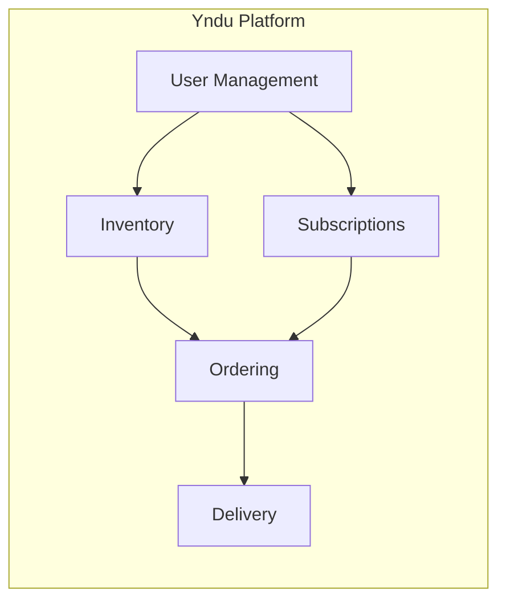
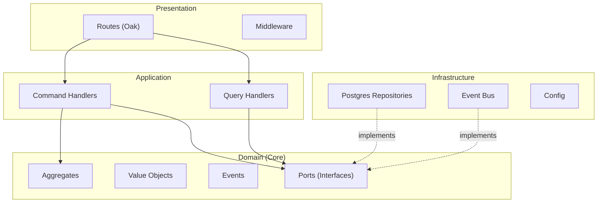
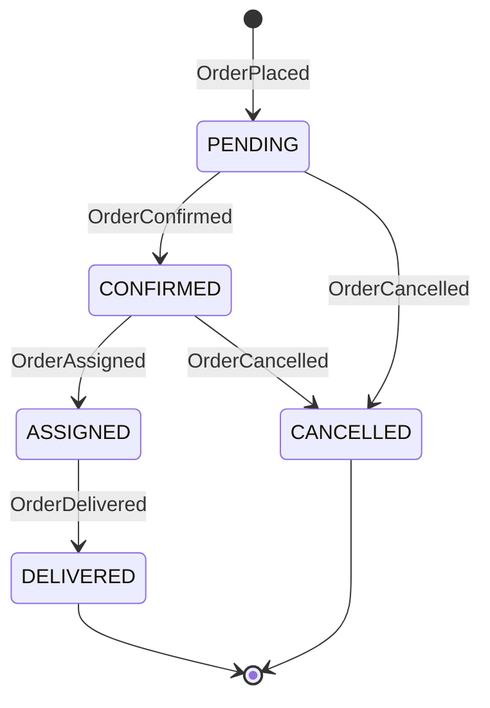
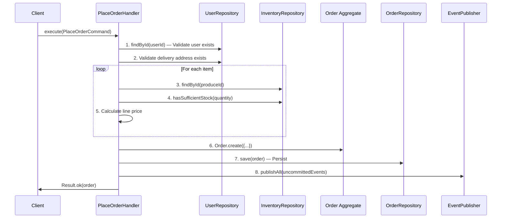
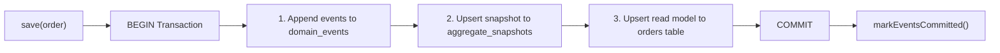
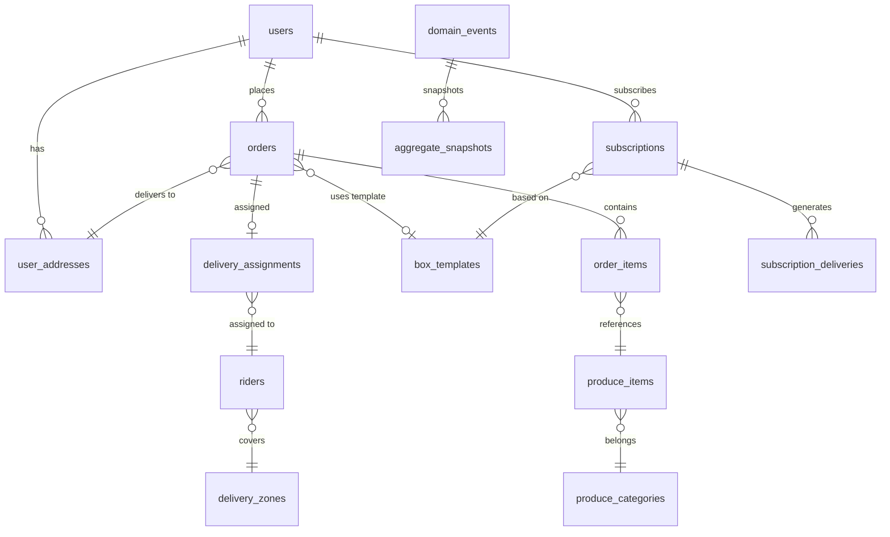

# Yndu Backend & Database Architecture Study

> **Yndu** — A fresh produce delivery platform serving Kenyan markets, built with Domain-Driven
> Design, Event Sourcing, and Hexagonal Architecture on the Deno runtime.

---

## Table of Contents

1. [System Overview](#1-system-overview)
2. [Technology Stack](#2-technology-stack)
3. [Architecture: Hexagonal / Ports & Adapters](#3-architecture-hexagonal--ports--adapters)
4. [Domain Layer](#4-domain-layer)
5. [Application Layer](#5-application-layer)
6. [Infrastructure Layer](#6-infrastructure-layer)
7. [Presentation Layer (Routes & Middleware)](#7-presentation-layer-routes--middleware)
8. [Database Schema](#8-database-schema)
9. [GraphQL Federation](#9-graphql-federation)
10. [Testing Strategy](#10-testing-strategy)
11. [Configuration & DevOps](#11-configuration--devops)
12. [Current Gaps & TODOs](#12-current-gaps--todos)

---

## 1. System Overview

Yndu is a **fresh produce box delivery platform** targeting Kenyan consumers. Customers select
pre-configured produce boxes (Small, Medium, Large) or customize their own selections, choose a
delivery slot (same-day or next-day), and subscribe for recurring deliveries. The system manages the
full lifecycle: **inventory → ordering → delivery logistics**.

### Bounded Contexts



| Context             | Responsibility                                               |
| ------------------- | ------------------------------------------------------------ |
| **User Management** | Registration, profiles, addresses, authentication            |
| **Inventory**       | Produce items, stock levels, seasonality, box templates      |
| **Ordering**        | Order placement, confirmation, cancellation, status tracking |
| **Subscriptions**   | Recurring delivery schedules (weekly/biweekly/monthly)       |
| **Delivery**        | Rider assignment, route management, delivery proof           |

---

## 2. Technology Stack

| Layer                | Technology                | Purpose                                                         |
| -------------------- | ------------------------- | --------------------------------------------------------------- |
| **Runtime**          | Deno                      | Secure TypeScript runtime, native URL imports, built-in tooling |
| **Web Framework**    | Oak                       | Koa-style middleware framework for Deno                         |
| **Database**         | PostgreSQL                | JSONB, partitioning, POINT/GEOMETRY types, CHECK constraints    |
| **Cache**            | Redis                     | Session store, event bus (planned)                              |
| **Validation**       | Zod                       | Runtime schema validation for API inputs                        |
| **API**              | REST + GraphQL Federation | REST routes (primary), Apollo Gateway (planned)                 |
| **Migrations**       | Knex.js                   | Database migration and seeding framework                        |
| **Containerization** | Docker Compose            | Multi-service orchestration                                     |

### Dependency Management (`deps.ts`)

Deno uses centralized URL imports rather than `node_modules`. All external dependencies are
re-exported from `src/deps.ts`:

```typescript
// Standard library
export { assertEquals } from 'https://deno.land/std/assert/mod.ts';
// Database
export { Client as PostgresClient } from 'https://deno.land/x/postgres/mod.ts';
// Web framework
export { Application, Router } from 'https://deno.land/x/oak/mod.ts';
// Validation
export { z } from 'https://deno.land/x/zod/mod.ts';
```

---

## 3. Architecture: Hexagonal / Ports & Adapters

The system follows **Hexagonal Architecture** (also known as Ports & Adapters), enforcing a strict
dependency rule: outer layers depend on inner layers, never the reverse.



### Directory Structure

```
src/
├── main.ts                     # Entry point
├── deps.ts                     # Centralized imports
├── domain/                     # Core business logic (no external deps)
│   ├── aggregates/
│   │   ├── Order/              # Order aggregate root
│   │   └── ProduceItem/        # Inventory aggregate
│   ├── events/                 # Domain events
│   ├── value-objects/          # Immutable value types
│   └── ports/                  # Interface contracts
├── application/                # Use cases / orchestration
│   ├── commands/               # Write operations
│   ├── handlers/               # Command & query execution
│   └── queries/                # Read operations
├── infrastructure/             # External system adapters
│   ├── adapters/
│   │   ├── postgres/           # DB repositories + migrations
│   │   ├── event-bus/          # Event publishing
│   │   ├── graphql/            # GraphQL resolvers (stub)
│   │   └── sms/                # SMS notifications (stub)
│   └── config/                 # Environment, DB, Redis config
├── middleware/                  # HTTP middleware
├── routes/                     # REST API endpoints
└── shared/                     # Cross-cutting utilities
```

---

## 4. Domain Layer

The domain layer contains **zero external dependencies** — it defines the core business rules using
aggregates, value objects, events, and port interfaces.

### 4.1 Aggregates

#### Order Aggregate (`src/domain/aggregates/Order/Order.ts`)

The Order is the most complex aggregate, implementing **full event sourcing**. Every state change is
captured as a domain event.

**Lifecycle:**



**Key Methods:**

| Method            | Event Emitted    | Business Rule                                               |
| ----------------- | ---------------- | ----------------------------------------------------------- |
| `Order.create()`  | `OrderPlaced`    | Validates items, calculates total, determines delivery slot |
| `confirm()`       | `OrderConfirmed` | Only from PENDING status                                    |
| `cancel()`        | `OrderCancelled` | Only from PENDING or CONFIRMED                              |
| `assignRider()`   | `OrderAssigned`  | Only from CONFIRMED status                                  |
| `markDelivered()` | `OrderDelivered` | Only from ASSIGNED status, optional delivery proof          |

**Event Sourcing Implementation:**

```typescript
class Order {
  private uncommittedEvents: DomainEvent[] = [];

  private applyEvent(event: DomainEvent): void {
    this.uncommittedEvents.push(event);
    this.version = event.version;
    // State transitions based on event type...
  }

  static rehydrate(events: DomainEvent[]): Order {
    // Replays all events to reconstruct current state
  }

  toSnapshot(): object {/* Serializes current state */}
}
```

**Invariants** (`invariants.ts`):

| Rule                  | Constant                           | Value     |
| --------------------- | ---------------------------------- | --------- |
| Small box max weight  | `ORDER_RULES.SMALL_BOX.maxWeight`  | 5 kg      |
| Small box max items   | `ORDER_RULES.SMALL_BOX.maxItems`   | 8         |
| Small box price       | `ORDER_RULES.SMALL_BOX.basePrice`  | KES 500   |
| Medium box max weight | `ORDER_RULES.MEDIUM_BOX.maxWeight` | 10 kg     |
| Medium box max items  | `ORDER_RULES.MEDIUM_BOX.maxItems`  | 15        |
| Medium box price      | `ORDER_RULES.MEDIUM_BOX.basePrice` | KES 900   |
| Large box max weight  | `ORDER_RULES.LARGE_BOX.maxWeight`  | 20 kg     |
| Large box max items   | `ORDER_RULES.LARGE_BOX.maxItems`   | 25        |
| Large box price       | `ORDER_RULES.LARGE_BOX.basePrice`  | KES 1,500 |
| Same-day cutoff       | `ORDER_RULES.SAME_DAY_CUTOFF`      | 10 AM     |

#### ProduceItem Aggregate (`src/domain/aggregates/ProduceItem/ProduceItem.ts`)

Manages individual produce items in inventory. Unlike Order, it uses **traditional state
persistence** (not event sourced).

**Capabilities:**

- `decrementStock(quantity)` — Reduces available stock, throws if insufficient
- `incrementStock(quantity)` — Restocks items
- `isLowStock()` — Checks if below reorder threshold
- `updateSeasonality(isSeasonal, start?, end?)` — Manages seasonal availability

**Categories:** `LEAFY_GREENS`, `ROOT_VEGETABLES`, `FRUITS`, `HERBS`

### 4.2 Value Objects

Value objects are **immutable**, compared by value (not identity), and encapsulate domain-specific
types.

#### Money (`Money.ts`)

Stores all currency amounts as **integer cents (KES)** to avoid floating-point errors.

```typescript
class Money {
  private constructor(readonly amount: KES, readonly currency: 'KES' = 'KES') {}

  static fromCents(cents: number): Money; // KES 50.00 = 5000 cents
  static fromShillings(shillings: number): Money;
  add(other: Money): Money;
  multiply(factor: number): Money;
  toShillings(): number;
  toDisplay(): string; // "KES 50.00"
}
```

> **Design Decision:** Integer cents storage eliminates floating-point rounding errors that could
> cause financial discrepancies. The database mirrors this with `INTEGER` columns for all price
> fields.

#### Quantity (`Quantity.ts`)

Represents measurable amounts with units, enforcing unit consistency for arithmetic.

```typescript
type Unit = 'kg' | 'g' | 'pcs' | 'bunches';

class Quantity {
  static kilograms(value: number): Quantity;
  toKilograms(): number; // Converts g → kg (÷1000)
  add(other: Quantity): Quantity; // Throws if units differ
}
```

#### DeliverySlot (`DeliverySlot.ts`)

Determines delivery type based on order time and a **10 AM cutoff**.

```typescript
class DeliverySlot {
  type: 'SAME_DAY' | 'NEXT_DAY';
  date: Date;

  static create(preferredDate: Date): DeliverySlot {
    // If ordered before 10 AM and preferredDate is today → SAME_DAY
    // Otherwise → NEXT_DAY
  }
}
```

#### Branded Types (`branded.ts`)

Uses TypeScript's structural type system to create **nominal types** for IDs, preventing accidental
misuse:

```typescript
type Brand<K, T> = K & { __brand: T };

type UserId = Brand<string, 'UserId'>;
type OrderId = Brand<string, 'OrderId'>;
type ProduceItemId = Brand<string, 'ProduceItemId'>;
type AddressId = Brand<string, 'AddressId'>;
```

This means a `UserId` cannot be passed where an `OrderId` is expected, even though both are strings.

### 4.3 Domain Events

Events are the **source of truth** for the Order aggregate. Each event extends the abstract
`DomainEvent` base class.

#### Base Event

```typescript
abstract class DomainEvent {
  readonly occurredAt: Date;
  readonly correlationId: string; // Groups related events
  readonly causationId: string; // Event that caused this event

  constructor(
    readonly aggregateId: string,
    readonly version: number,
    metadata?: EventMetadata,
  ) {}
}
```

#### Event Catalog

| Event                           | Context   | Key Data                                                     |
| ------------------------------- | --------- | ------------------------------------------------------------ |
| `OrderPlaced`                   | Ordering  | userId, items[], totalPrice, deliverySlot, deliveryAddressId |
| `OrderConfirmed`                | Ordering  | confirmedAt, confirmedBy                                     |
| `OrderCancelled`                | Ordering  | cancelledAt, reason, cancelledBy                             |
| `OrderAssigned`                 | Ordering  | riderId, assignedAt                                          |
| `OrderDelivered`                | Ordering  | deliveredAt, deliveryProof?{photoUrl, signature, notes}      |
| `StockDecremented`              | Inventory | quantity, reason                                             |
| `StockIncremented`              | Inventory | quantity, reason                                             |
| `StockLow`                      | Inventory | availableQuantity, threshold                                 |
| `ProduceItemSeasonalityChanged` | Inventory | isSeasonal, seasonStart?, seasonEnd?                         |

### 4.4 Ports (Interfaces)

Ports define contracts that infrastructure adapters must implement, keeping the domain free of
external dependencies.

```typescript
// Order persistence
interface IOrderRepository {
  save(order: Order): Promise<void>;
  findById(id: OrderId): Promise<Order | null>;
  findByUserId(userId: string): Promise<Order[]>;
}

// Inventory persistence
interface IInventoryRepository {
  save(item: ProduceItem): Promise<void>;
  findById(id: ProduceItemId): Promise<ProduceItem | null>;
  findByCategory(category: string): Promise<ProduceItem[]>;
  findAll(): Promise<ProduceItem[]>;
}

// Event publishing
interface IEventPublisher {
  publish(event: DomainEvent): Promise<void>;
  publishAll(events: DomainEvent[]): Promise<void>;
}
```

---

## 5. Application Layer

The application layer orchestrates domain logic through **CQRS** (Command Query Responsibility
Segregation) — commands for writes, queries for reads.

### 5.1 Commands

#### PlaceOrderCommand

```typescript
interface PlaceOrderCommand {
  userId: UserId;
  items: OrderItemCommand[]; // [{produceId, quantity}]
  deliveryAddressId: AddressId;
  preferredDeliveryDate: Date;
  isSubscription: boolean;
  subscriptionFrequency?: 'WEEKLY' | 'BIWEEKLY' | 'MONTHLY';
}
```

### 5.2 Command Handlers

#### PlaceOrderHandler

The `PlaceOrderHandler` implements an 8-step transactional workflow:



**Error Handling:** Returns typed `Result<Order, DomainError>` monad instead of throwing:

| Error                      | Code                           | Cause                      |
| -------------------------- | ------------------------------ | -------------------------- |
| `UserNotFoundError`        | `USER.NOT_FOUND`               | User ID doesn't exist      |
| `AddressNotFoundError`     | `ADDRESS.NOT_FOUND`            | Address not found for user |
| `ProduceItemNotFoundError` | `INVENTORY.ITEM_NOT_FOUND`     | Produce item doesn't exist |
| `InsufficientStockError`   | `INVENTORY.INSUFFICIENT_STOCK` | Not enough stock           |

### 5.3 Queries

#### GetUserOrdersQuery

Reads directly from the **orders read model** (denormalized table), bypassing event sourcing for
performance.

```typescript
interface GetUserOrdersQuery {
  userId: UserId;
  status?: OrderStatus;
  fromDate?: Date;
  toDate?: Date;
  limit: number;
  offset: number;
}
```

The handler returns `UserOrderDto[]` with computed fields like `canCancel` and `canReorder`.

### 5.4 Result Monad (`shared/Result.ts`)

Functional error handling without exceptions:

```typescript
class Result<T, E> {
  static ok<T>(value: T): Result<T, never>;
  static fail<E>(error: E): Result<never, E>;
  isSuccess(): boolean;
  getValue(): T; // Throws if failed
  getError(): E; // Throws if succeeded
  map<U>(fn: (T) => U): Result<U, E>;
  flatMap<U>(fn: (T) => Result<U, E>): Result<U, E>;
}
```

---

## 6. Infrastructure Layer

### 6.1 PostgresOrderRepository

Implements the event sourcing persistence strategy within a **single database transaction**:



**Event Deserialization:** The `deserializeEvent()` method reconstructs typed event objects from raw
JSONB rows, handling all 5 order event types with a switch statement.

**Read path:** `findById()` loads events from `domain_events` and calls `Order.rehydrate()`.
`findByUserId()` reads from the denormalized `orders` table for performance.

### 6.2 PostgresInventoryRepository

Standard CRUD repository using Knex query builder patterns:

- `save()` → Upsert (`INSERT ... ON CONFLICT DO UPDATE`)
- `findById()` → Single row lookup
- `findByCategory()` → Filtered query (active items only)
- `findAll()` → All active items

Maps between database snake_case columns and domain camelCase objects.

### 6.3 InMemoryEventBus

Current event publisher implementation — stores handlers in a `Map<eventType, handler[]>`:

```typescript
class InMemoryEventBus implements IEventPublisher {
  subscribe<T extends DomainEvent>(eventType: string, handler: EventHandler<T>): void;
  publish(event: DomainEvent): Promise<void>; // Concurrent handler execution
  publishAll(events: DomainEvent[]): Promise<void>;
}
```

> **Note:** This is a development-only implementation. Production should use Redis Pub/Sub for
> cross-service communication.

### 6.4 Configuration

| File                 | Responsibility                                           |
| -------------------- | -------------------------------------------------------- |
| `config/env.ts`      | Typed config object (server, database, redis, cors, jwt) |
| `config/database.ts` | PostgreSQL client connection using `deno-postgres`       |
| `config/redis.ts`    | Redis client connection                                  |

All configs load from `.env` via `std/dotenv` with sensible defaults.

---

## 7. Presentation Layer (Routes & Middleware)

### 7.1 Route Structure

```
/health             → Health check (status, uptime, version)
/health/ready       → Readiness probe (DB + Redis checks)
/api/orders         → GET (list), POST (create)
/api/orders/:id     → GET (by ID)
/api/orders/:id/status → PUT (update status)
/api/inventory      → GET (list)
/api/inventory/:id  → GET (by ID)
/api/users/me       → GET (current user)
/api/users/:id      → GET (by ID)
/graphql            → POST (GraphQL endpoint - stub)
```

### 7.2 Input Validation (Zod)

The order creation route uses Zod middleware for schema validation:

```typescript
const createOrderSchema = z.object({
  userId: z.string().uuid(),
  items: z.array(z.object({
    produceId: z.string().uuid(),
    quantity: z.number().positive(),
    unit: z.enum(['kg', 'pcs', 'bunches', 'g']),
  })).min(1),
  deliveryAddressId: z.string().uuid(),
  preferredDeliveryDate: z.string().regex(/^\d{4}-\d{2}-\d{2}$/),
  isSubscription: z.boolean().default(false),
  subscriptionFrequency: z.enum(['WEEKLY', 'BIWEEKLY', 'MONTHLY']).optional(),
});
```

Validation errors return structured JSON:

```json
{
  "error": "Validation Error",
  "details": [{ "path": "items.0.quantity", "message": "Number must be greater than 0" }]
}
```

### 7.3 Middleware

| Middleware      | Purpose                                                      |
| --------------- | ------------------------------------------------------------ |
| `requestLogger` | Logs `{timestamp} {method} {path} {status} {duration}ms`     |
| `errorHandler`  | Catches errors, returns structured `{error, code}` responses |
| CORS            | Configured via `oak_cors`, origin from `.env`                |

### 7.4 Current Route Status

> **Important:** Route handlers currently contain **TODO comments** — they return placeholder
> responses and don't wire to application handlers yet. This is the primary integration gap.

---

## 8. Database Schema

The database schema is defined across two migrations, evolving from a basic schema to a
production-grade design.

### 8.1 Schema Overview



### 8.2 Tables by Context

#### Event Sourcing Infrastructure

| Table                 | Purpose                  | Key Features                                                                             |
| --------------------- | ------------------------ | ---------------------------------------------------------------------------------------- |
| `domain_events`       | Event store              | Partitioned by month, JSONB payload, unique `(stream_id, version)`, GIN index on payload |
| `aggregate_snapshots` | Performance optimization | Snapshot of aggregate state for fast loading, soft delete support                        |

**Partitioning Strategy:** `domain_events` is partitioned by `occurred_at` (monthly). A PL/pgSQL
block auto-generates 12 past + 3 future monthly partitions.

#### User Management

| Table            | Purpose            | Key Features                                                                                                        |
| ---------------- | ------------------ | ------------------------------------------------------------------------------------------------------------------- |
| `users`          | User accounts      | Unique email/phone, JSONB profile, status lifecycle (active/suspended/deactivated), soft delete, optimistic locking |
| `user_addresses` | Delivery addresses | POINT coordinates, zone constraint, `is_default` unique per user, GIST index for spatial queries                    |

#### Inventory

| Table                 | Purpose               | Key Features                                                                                       |
| --------------------- | --------------------- | -------------------------------------------------------------------------------------------------- |
| `produce_categories`  | Normalized categories | Pre-seeded (Leafy Greens, Root Vegetables, Fruits, Herbs) with Swahili names                       |
| `produce_items`       | Product catalog       | Integer cents pricing, seasonal date validation (CHECK constraint), version for optimistic locking |
| `box_templates`       | Pre-configured boxes  | Size-specific CHECK constraints enforce business rules (e.g., Small = 5kg, 8 items, KES 500)       |
| `inventory_movements` | Audit trail           | IN/OUT/ADJUSTMENT/RETURN with before/after quantities                                              |

#### Ordering

| Table                  | Purpose                    | Key Features                                                                                    |
| ---------------------- | -------------------------- | ----------------------------------------------------------------------------------------------- |
| `orders`               | Order aggregate read model | 6 statuses, payment tracking, address snapshot preservation, partial indexes for common queries |
| `order_items`          | Line items (3NF)           | References produce items, stores price snapshot at order time                                   |
| `order_status_history` | Status audit trail         | Previous/new status with timestamp and actor                                                    |

#### Subscriptions

| Table                      | Purpose           | Key Features                                                |
| -------------------------- | ----------------- | ----------------------------------------------------------- |
| `subscriptions`            | Recurring orders  | WEEKLY/BIWEEKLY/MONTHLY frequency, pause/cancel with reason |
| `subscription_frequencies` | Normalized lookup | Interval days mapping                                       |
| `subscription_deliveries`  | Delivery tracking | SCHEDULED/DELIVERED/SKIPPED/CANCELLED per occurrence        |

#### Delivery

| Table                  | Purpose             | Key Features                                                                           |
| ---------------------- | ------------------- | -------------------------------------------------------------------------------------- |
| `delivery_zones`       | Geographic zones    | Kibwezi Central/North, Nairobi East/West, PostGIS GEOMETRY support                     |
| `riders`               | Delivery personnel  | Zone assignment, location tracking (POINT + GIST), work schedule (JSONB), vehicle info |
| `rider_availability`   | Capacity planning   | Daily max orders, assigned count, unique per rider-date                                |
| `delivery_assignments` | Order-rider linking | Full status workflow, delivery proof (photo/signature/notes/GPS), rating               |

#### Audit & Analytics

| Table                   | Purpose                                                                   |
| ----------------------- | ------------------------------------------------------------------------- |
| `audit_log`             | Generic audit trail (table, record, action, old/new data, IP, user agent) |
| `audit_log_partitioned` | Monthly-partitioned copy for long-term retention                          |
| `orders_archive`        | Cold storage for orders delivered >1 year ago                             |
| `domain_events_archive` | Cold storage for old events                                               |

### 8.3 Views & Materialized Views

| View                | Purpose                                              | Type                             |
| ------------------- | ---------------------------------------------------- | -------------------------------- |
| `v_active_orders`   | Active orders with user/address info                 | Regular                          |
| `mv_orders_by_date` | Revenue analytics by delivery date, slot, and status | **Materialized** (refresh daily) |
| `v_low_stock_items` | Items at or below reorder threshold                  | Regular                          |

### 8.4 Stored Functions

| Function                   | Signature                | Purpose                                                     |
| -------------------------- | ------------------------ | ----------------------------------------------------------- |
| `can_cancel_order`         | `(UUID) → BOOLEAN`       | Checks if order status and delivery date allow cancellation |
| `calculate_next_delivery`  | `(DATE, VARCHAR) → DATE` | Computes next delivery date from frequency                  |
| `archive_old_orders`       | `(INTEGER) → INTEGER`    | Moves delivered orders older than N days to archive         |
| `update_updated_at_column` | Trigger function         | Auto-sets `updated_at` on UPDATE                            |
| `increment_version`        | Trigger function         | Auto-increments `version` for optimistic locking            |

### 8.5 Key Design Decisions

| Decision                         | Rationale                                                           |
| -------------------------------- | ------------------------------------------------------------------- |
| **Integer cents for money**      | Avoids floating-point rounding errors in financial calculations     |
| **CHECK constraints over ENUMs** | More flexible — can add values without migration                    |
| **JSONB for flexible data**      | Profile, box items, order customizations, delivery proof            |
| **Partial indexes**              | Index only relevant rows (e.g., active orders, pending deliveries)  |
| **GIN indexes**                  | Efficient JSONB querying for payload searches                       |
| **GIST indexes**                 | Spatial queries on POINT coordinates for location-based routing     |
| **Monthly partitioning**         | Prevents unbounded table growth for events and audit logs           |
| **Soft deletes**                 | `deleted_at` preserves referential integrity and enables undeletion |
| **Optimistic locking**           | `version` column + trigger prevents concurrent update conflicts     |
| **Address snapshots**            | `delivery_address_snapshot` preserves historical delivery location  |
| **Normalized categories**        | `produce_categories` table instead of inline strings                |

---

## 9. GraphQL Federation

The system is designed for **Apollo Federation**, composing three independent subgraph services into
a unified API.

### Gateway (`gateway/src/index.js`)

Apollo Gateway using `IntrospectAndCompose` to combine subgraphs:

```javascript
const gateway = new ApolloGateway({
  supergraphSdl: new IntrospectAndCompose({
    subgraphs: [
      { name: 'users', url: 'http://localhost:4001/graphql' },
      { name: 'inventory', url: 'http://localhost:4002/graphql' },
      { name: 'orders', url: 'http://localhost:4003/graphql' },
    ],
  }),
});
```

### Subgraph Schemas

| Service       | Key Types                                          | Federated Keys                                                     |
| ------------- | -------------------------------------------------- | ------------------------------------------------------------------ |
| **users**     | `User`, `Address`, `UserProfile`, `GeoCoordinates` | `User @key(fields: "id")`                                          |
| **inventory** | `ProduceItem`, `BoxTemplate`, `Seasonality`        | `ProduceItem @key(fields: "id")`, `BoxTemplate @key(fields: "id")` |
| **orders**    | `Order`, `OrderItem`, `DeliverySlot`, `Money`      | `Order @key(fields: "id")`                                         |

---

## 10. Testing Strategy

### Unit Tests (`tests/unit/money_test.ts`)

Tests the `Money` value object using Deno's built-in test runner:

```typescript
Deno.test('Money.fromCents should create money from cents', () => {
  const money = Money.fromCents(5000);
  assertEquals(money.amount, 5000);
  assertEquals(money.currency, 'KES');
});
```

### Integration Tests (`tests/integration/orders_test.ts`)

HTTP-level tests against a running server:

- `GET /health` → Validates healthy status
- `GET /api/orders` → Validates order list response shape

### Running Tests

```bash
deno task test   # Runs all tests with --allow-net --allow-read --allow-env
```

---

## 11. Configuration & DevOps

### Environment Variables (`.env.example`)

```bash
NODE_ENV=development
PORT=8000
HOST=0.0.0.0
DATABASE_HOST=localhost
DATABASE_PORT=5432
DATABASE_USER=yndu_user
DATABASE_PASSWORD=yndu_pass
DATABASE_NAME=yndu
REDIS_HOST=localhost
REDIS_PORT=6379
CORS_ORIGIN=http://localhost:3000
JWT_SECRET=your-secret-key-change-in-production
JWT_EXPIRES_IN=24h
```

### Deno Tasks (`deno.json`)

| Task      | Command                                    | Purpose                        |
| --------- | ------------------------------------------ | ------------------------------ |
| `dev`     | `deno run --watch --allow-all src/main.ts` | Development with file watching |
| `start`   | `deno run --allow-all src/main.ts`         | Production start               |
| `test`    | `deno test --allow-all`                    | Run test suite                 |
| `lint`    | `deno lint`                                | Code linting                   |
| `fmt`     | `deno fmt`                                 | Code formatting                |
| `compile` | `deno compile --allow-all src/main.ts`     | Compile to binary              |

### Docker Compose Services

| Service             | Image            | Port | Purpose                   |
| ------------------- | ---------------- | ---- | ------------------------- |
| `gateway`           | Custom (Node.js) | 4000 | Apollo Federation Gateway |
| `user-service`      | Custom (Deno)    | 4001 | User management subgraph  |
| `inventory-service` | Custom (Deno)    | 4002 | Inventory subgraph        |
| `order-service`     | Custom (Deno)    | 4003 | Order subgraph            |
| `postgres`          | postgres:17      | 5432 | PostgreSQL database       |
| `redis`             | redis:7          | 6379 | Cache & pub/sub           |
| `frontend`          | Custom (Node.js) | 3000 | Nuxt 4 frontend           |

---

## 12. Current Gaps & TODOs

### Critical — Blocking Production

| Gap                                         | Location                                                 | Impact                                                 |
| ------------------------------------------- | -------------------------------------------------------- | ------------------------------------------------------ |
| Route handlers not wired to app layer       | `src/routes/orders/handlers.ts`                          | All API endpoints return placeholder data              |
| `InMemoryEventBus` not production-ready     | `infrastructure/adapters/event-bus/`                     | Events lost on restart, no cross-service communication |
| Repository implementations use `any` for DB | `PostgresOrderRepository`, `PostgresInventoryRepository` | No type safety for DB client                           |
| GraphQL subgraphs not implemented           | `services/*/`                                            | Only schema files exist, no resolvers                  |

### Important — Needed for Feature Completeness

| Gap                                                | Location                       | Impact                               |
| -------------------------------------------------- | ------------------------------ | ------------------------------------ |
| User/Subscription/Rider aggregates not implemented | `src/domain/aggregates/`       | Only Order and ProduceItem exist     |
| No authentication middleware                       | `src/middleware/`              | JWT secret defined but not used      |
| No SMS notification adapter                        | `infrastructure/adapters/sms/` | Directory exists but empty           |
| Health readiness checks are stubs                  | `src/routes/health/mod.ts`     | DB/Redis checks return `true` always |

### Nice to Have

| Gap                                                    | Impact                                     |
| ------------------------------------------------------ | ------------------------------------------ |
| Replace `IntrospectAndCompose` with managed federation | Better performance and versioning          |
| Add OpenTelemetry tracing                              | Observability across services              |
| Implement CQRS read model projections                  | Better data separation for complex queries |

---

_Last updated: Generated from codebase analysis_
